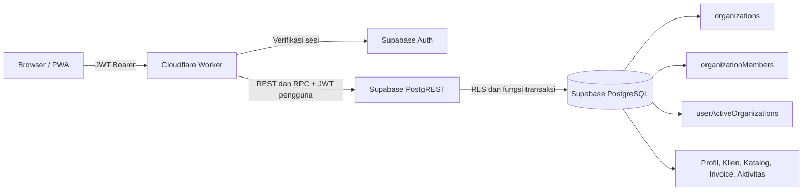

# Arsitektur Isolasi Data Organisasi Faktur

**Tanggal:** 26 Agustus 2026  
**Status:** Diterapkan pada produksi dan divalidasi dengan dua akun; perbaikan active-workspace stale juga telah diterapkan.

> **Klarifikasi utama:** Aplikasi Faktur saat ini memakai **Cloudflare Workers + Supabase PostgreSQL**, bukan Cloudflare D1. Worker menangani API dan konteks akses di edge, sedangkan isolasi data inti dipaksakan oleh Row Level Security (RLS) PostgreSQL di Supabase. D1 adalah database SQLite serverless yang dapat diakses Worker melalui binding `env.<BINDING>` dan prepared statements, tetapi tidak dipakai oleh deployment Faktur saat ini.[1] [2]

## 1. Gambaran Arsitektur Produksi

Permintaan aplikasi menuju endpoint tRPC di Cloudflare Worker membawa token sesi Supabase. Worker memverifikasi token tersebut melalui endpoint Auth, mengambil profil aplikasi, membaca workspace aktif, lalu memeriksa membership pengguna pada workspace tersebut. Konteks hasilnya berupa `userId`, `organizationId`, dan `organizationRole`. Prosedur yang membutuhkan data bisnis menolak permintaan apabila salah satu dari organisasi aktif atau role tidak tersedia.

| Lapisan | Implementasi saat ini | Fungsi keamanan |
|---|---|---|
| Identitas | Supabase Auth dan JWT Bearer | Memastikan permintaan berasal dari pengguna terautentikasi. |
| API edge | Cloudflare Worker dan tRPC | Menyusun konteks pengguna/organisasi, memvalidasi input, dan memeriksa role pada prosedur sensitif. |
| Batas tenant | `organizationId` pada tabel inti | Mengaitkan profil bisnis, klien, katalog, invoice, dan aktivitas pada satu organisasi. |
| Otorisasi database | PostgreSQL RLS | Menambah pembatas baris pada operasi baca/tulis sehingga Worker yang salah filter tetap tidak memperoleh data organisasi lain.[3] |
| Konsistensi transaksi | RPC PostgreSQL atomik | Membuat, memperbarui, mengimpor, menduplikasi, dan memproses invoice dengan konteks organisasi dari database. |

## 2. Model Tenant dan Role

Setiap akun baru memperoleh organisasi pribadi dan membership **Pemilik** melalui trigger registrasi. Model data organisasi terdiri dari `organizations`, `organizationMembers`, `userActiveOrganizations`, serta `organizationInvitations`. Tabel inti mempertahankan `userId` sebagai jejak aktor/audit selama masa transisi, tetapi `organizationId` adalah batas tenant operasional.

| Role | Hak utama | Batas penting |
|---|---|---|
| **Pemilik** | Mengelola organisasi, anggota, role, undangan, dan seluruh data bisnis. | Tidak dapat menghapus atau menurunkan role dirinya sendiri melalui UI/API tim. |
| **Admin** | Mengelola data bisnis dan membuat/membatalkan undangan. | Tidak dapat mengubah role anggota atau menghapus anggota. |
| **Staf** | Mengelola data operasional yang diizinkan, termasuk klien, katalog, dan invoice. | Tidak dapat mengelola anggota maupun undangan; perubahan profil bisnis dibatasi RLS untuk Pemilik/Admin. |

Undangan tidak menyimpan token mentah. Worker membuat token acak, menyimpan hash SHA-256, menetapkan masa berlaku tujuh hari, dan mengembalikan tautan sekali pakai hanya saat pembuatan. Fungsi penerimaan undangan memeriksa bahwa email akun penerima sama dengan email pada undangan, menambahkan membership, menandai undangan diterima, dan memindahkan organisasi aktif penerima.

## 3. Cara Isolasi Data Dipaksakan

RLS PostgreSQL memperlakukan policy sebagai pembatas tambahan pada setiap operasi tabel.[3] Pada Faktur, helper `current_faktur_organization_id()` menentukan organisasi aktif berdasarkan `userActiveOrganizations` **hanya jika** pengguna masih memiliki membership pada organisasi tersebut. Bila tidak valid, helper memilih membership lain milik pengguna; bila tidak ada, helper mengembalikan `NULL` dan data bisnis tidak dapat diakses.

| Entitas | Aturan baca | Aturan tulis |
|---|---|---|
| Profil bisnis | Hanya `organizationId` aktif | Pemilik/Admin. |
| Klien dan katalog | Hanya `organizationId` aktif | Pemilik/Admin/Staf dapat buat/ubah; hapus Pemilik/Admin. |
| Invoice | Hanya `organizationId` aktif | Pemilik/Admin/Staf dapat buat/ubah; hapus Pemilik/Admin. |
| Item invoice | Mengikuti `organizationId` dari invoice induk | Mengikuti role operasional dan invoice induk. |
| Aktivitas invoice | Hanya `organizationId` aktif | Ditulis dengan `organizationId` dan `userId` aktor. |
| Anggota dan undangan | Anggota workspace aktif; manajer untuk undangan | Pemilik untuk role/keanggotaan; Pemilik/Admin untuk undangan. |

Fungsi invoice atomik tidak menerima `organizationId` dari browser. Fungsi mengambil organisasi melalui helper database, kemudian memastikan klien, katalog, nomor invoice, invoice sumber, dan profil bisnis berada pada organisasi yang sama. Dengan demikian, pengguna tidak dapat mengubah tenant hanya dengan memanipulasi payload aplikasi.

## 4. Temuan dan Perbaikan Saat Uji Dua Akun

Pengujian menemukan kondisi **active-workspace stale**: setelah seorang anggota dihapus, tabel workspace aktifnya masih dapat menunjuk ke organisasi lama. Walaupun membership telah dihapus, pointer yang stale tidak boleh dipercaya sebagai dasar RLS.

Perbaikan `20260826_000015_active_organization_membership_guard.sql` menerapkan dua pengaman. Pertama, helper organisasi aktif sekarang memeriksa keberadaan membership yang cocok sebelum mengembalikan organisasi dari pointer aktif. Kedua, trigger `after delete` pada `organizationMembers` secara otomatis memindahkan akun ke organisasi lain yang masih dimilikinya atau menghapus pointer aktif bila tidak ada organisasi tersisa.

> Perbaikan ini mengubah status dari “membership dicabut tetapi pointer dapat stale” menjadi “membership dicabut dan pointer aktif segera direparasi; RLS juga menolak pointer yang stale sebagai lapisan cadangan.”

## 5. Hasil Uji End-to-End Dua Akun

Pengujian menggunakan akun pemilik dan satu akun kedua yang disetujui. Tidak ada invoice, klien, katalog, atau konfigurasi bisnis pemilik yang dibuat atau diubah selama uji.

| Langkah | Hasil yang diharapkan | Hasil aktual |
|---|---|---|
| Membuka undangan dengan akun pemilik | Ditolak karena email tidak cocok | Ditolak. |
| Menerima undangan dengan akun kedua | Membership Staf dibuat dan workspace berpindah | Berhasil; dashboard organisasi pemilik dapat dibaca sebagai Staf. |
| Melihat kontrol tim sebagai Staf | Tidak ada kontrol undangan/role | Kontrol manajemen tim tidak tampil. |
| Pindah ke workspace pribadi akun kedua | Data organisasi pemilik tidak terbawa | Dashboard menunjukkan nol invoice dan nol metrik. |
| Membuka Invoice, Klien, Katalog pribadi | Tidak ada data milik organisasi pemilik | Ketiganya kosong. |
| Menghapus membership Staf uji | Akun kedua kehilangan akses organisasi pemilik | Membership dihapus secara terarah. |
| Login ulang akun kedua pascapenghapusan | Hanya organisasi pribadi yang tersedia | Satu workspace pribadi dan satu anggota terlihat; data pemilik tidak tersedia. |

Regresi aplikasi terakhir menghasilkan **59 berkas pengujian dan 129 tes lulus**, disertai pengecekan TypeScript serta build Cloudflare yang berhasil.

## 6. Mengapa Tidak Menggunakan D1 Saat Ini

Cloudflare D1 dapat menjadi pilihan database SQLite yang dekat dengan Worker. D1 diakses melalui binding pada `env` dan API prepared statement seperti `env.DB.prepare(...).bind(...).run()`.[1] [2] Namun, ia bukan bagian dari deployment Faktur saat ini.

Perpindahan ke D1 tidak cukup berupa mengganti koneksi database. Isolasi yang sekarang dijalankan oleh RLS PostgreSQL, fungsi PostgreSQL, trigger, enum, dan RPC atomik perlu diimplementasikan ulang secara eksplisit di Worker dan transaksi SQLite. Artinya, setiap query D1 harus memasukkan `organizationId` yang diturunkan dari sesi server, dan semua operasi multi-tabel harus dijaga dalam transaksi aplikasi. Jika salah satu query lupa memasukkan filter tenant, D1 tidak memberikan lapisan RLS PostgreSQL sebagai pengaman kedua.

| Topik | Arsitektur Faktur saat ini | Bila memakai D1 di masa depan |
|---|---|---|
| Database | Supabase PostgreSQL | Cloudflare D1 / SQLite. |
| Isolasi utama | RLS per baris di database | Validasi wajib di Worker dan query tenant-scoped. |
| Invoice atomik | Fungsi PostgreSQL/RPC | Transaksi D1 dan repository Worker. |
| Auth | Supabase Auth + JWT | Tetap bisa Supabase Auth atau provider lain; Worker harus memverifikasi token. |
| Risiko migrasi | Tidak ada migrasi database tambahan | Tinggi: SQL, transaksi, RLS, data, dan uji keamanan perlu ditulis ulang. |

Untuk kondisi Faktur saat ini, mempertahankan **Worker + Supabase PostgreSQL RLS** lebih aman dan lebih hemat risiko daripada memindahkan data produksi ke D1. D1 dapat dievaluasi nanti untuk data non-kritis atau cache yang tenant-scoped, bukan sebagai pengganti langsung database invoice produksi tanpa proyek migrasi khusus.

## 7. Batas Kesiapan yang Masih Ada

Fondasi multi-tenant dan uji dua akun telah selesai, tetapi ini belum cukup untuk menyatakan kesiapan SaaS publik sepenuhnya. Langkah berikutnya yang relevan adalah pengujian policy database otomatis berbasis pgTAP untuk tiap operasi role, penguatan penyimpanan logo agar path berbasis organisasi, audit grants eksplisit untuk semua tabel `public`, observabilitas keamanan, backup/restorasi teruji, serta billing dan batas penggunaan.

## Referensi

[1]: https://developers.cloudflare.com/d1/get-started/ "Cloudflare D1 — Getting started"
[2]: https://developers.cloudflare.com/d1/worker-api/ "Cloudflare D1 — Workers Binding API"
[3]: https://supabase.com/docs/guides/database/postgres/row-level-security "Supabase — Row Level Security"
